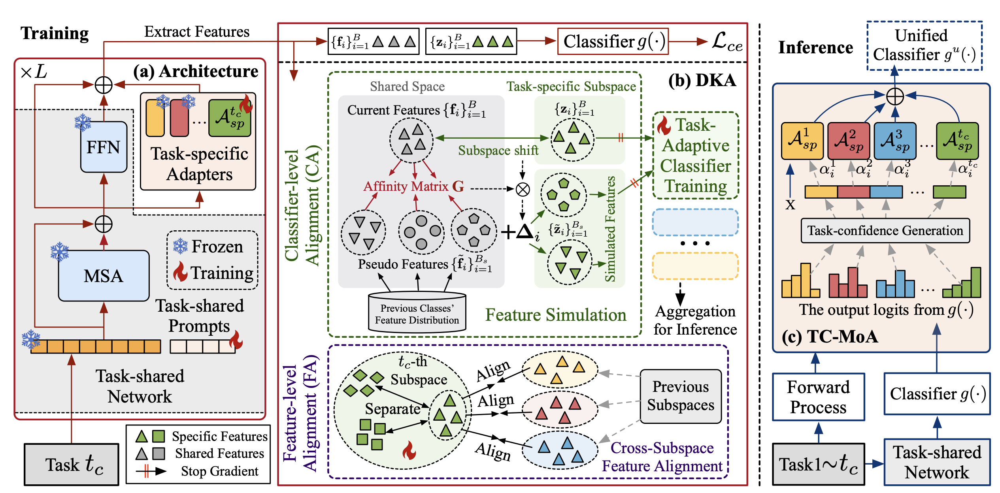

# CKAA: Cross-subspace Knowledge Alignment and Aggregation for Robust Continual Learning

Official PyTorch implementation of **CKAA**, a class-incremental learning framework built on Vision Transformers. 

Our paper [CKAA: Cross-subspace Knowledge Alignment and Aggregation for Robust Continual Learning](https://arxiv.org/abs/2507.09471) is accepted by IEEE Transactions on Image Processing (TIP), Aug 2026.



## Highlights

- We propose a DKA training approach for Continual Learning with task-specific modules, which enhances model robustness under misleading task-IDs.
- We propose Task-Confidence-guided Mixture-of-Adapter to better integrate task-specific information in inference without task-IDs.

## Repository Structure

```text
CKAA_master/
├── README.md
├── LICENSE
├── framework.png
├── requirements.txt
├── train_eval.py              # Main continual training and evaluation entry point
├── train_imagenet_a.sh        # 10-task ImageNet-A training script
├── train_imagenet_r.sh        # 10-task ImageNet-R training script
├── clip/                      # CLIP model, tokenizer, and text prompts
├── tools/                     # Dataset split lists and preparation scripts
└── utils/
    ├── continual_manager.py   # Class-incremental task construction
    ├── dataset_builder.py     # Unified dataset loaders and transforms
    ├── vit_builder.py         # ViT, prompts, adapters, prototypes, and losses
    ├── mod_adam.py            # Optimizer with projection-aware updates
    ├── logging.py             # Console/file logger
    ├── misc.py                # Metrics and utility functions
    └── osutils.py             # Filesystem helpers
```

## Environment

The experiments were developed with:

- Python 3.11.5
- PyTorch 2.1.0
- torchvision 0.16.0
- CUDA-capable NVIDIA GPU, tested on RTX 3090

Install dependencies:

```bash
cd CKAA_master
pip install -r requirements.txt
```

The project uses pretrained ViT weights from `timm` / Hugging Face Hub. Make sure the runtime environment can download pretrained weights, or prepare the corresponding model cache in advance.

## Dataset Preparation

Download the datasets you need:

- ImageNet-R: https://github.com/hendrycks/imagenet-r
- ImageNet-A: https://github.com/hendrycks/natural-adv-examples
- CIFAR-100: https://www.cs.toronto.edu/~kriz/cifar.html
- DomainNet: https://ai.bu.edu/M3SDA/
- CUB-200-2011: https://www.vision.caltech.edu/datasets/cub_200_2011/
- Stanford Cars: https://ai.stanford.edu/~jkrause/cars/car_dataset.html

All datasets are loaded through the same folder convention:

```text
DATA_ROOT/
├── train/
│   ├── class_folder_1/
│   │   ├── image_1.jpg
│   │   └── image_2.jpg
│   └── class_folder_2/
│       └── image_3.jpg
└── val/
    ├── class_folder_1/
    │   └── image_4.jpg
    └── class_folder_2/
        └── image_5.jpg
```

Dataset helpers and split files are provided in `tools/`. Before running a split script, update the hard-coded `root_dir` and split-list paths in the corresponding script so they match your local directory layout.

The current default dataset roots in `train_eval.py` are:

| Dataset argument | Default root |
| --- | --- |
| `cifar100` | `A_CLData/cifar100-split` |
| `imagenet_r` | `A_CLData/imagenet-r` |
| `imagenet_a` | `A_CLData/imagenet-a` |
| `sdomainet` | `A_CLData/domainnet` |
| `cub` | `A_CLData/cub` |
| `stanford_cars` | `A_CLData/stanford_cars` |

If your datasets are stored elsewhere, update this mapping in `train_eval.py` or adjust the scripts to point to your data location.

## Training

From the parent directory of `CKAA_master`, run:

```bash
bash CKAA_master/train_imagenet_r.sh
```

or:

```bash
bash CKAA_master/train_imagenet_a.sh
```

Both scripts launch 10-task class-incremental experiments with a ViT-B/16 backbone:

```bash
python CKAA_master/train_eval.py \
  -d imagenet_r \
  -sf 10s_imagenet_r \
  -m vit_base_patch16_224.augreg_in21k \
  -b 110 \
  --temperature 28.0 \
  -tf 0.05 \
  -kg 20 \
  -tg 0.2 \
  -tc 3.0 \
  -kc 10 \
  --null_eta1 0.97 \
  --null_eta2 0.97 \
  --seed 2024
```

Common options:

| Option | Description |
| --- | --- |
| `-d`, `--dataset` | Dataset key: `cifar100`, `imagenet_r`, `imagenet_a`, `sdomainet`, `cub`, or `stanford_cars` |
| `-t`, `--num_tasks` | Number of continual tasks |
| `-m`, `--model` | `timm` model name |
| `-b`, `--batch_size` | Training batch size |
| `-e`, `--epochs` | Epochs per task |
| `--seed` | Random seed for class order and training |
| `--logs-dir` | Output directory for logs |
| `-sf`, `--logs-suffix` | Log filename suffix |

Training logs are written to:

```text
logs/<logs-suffix>.txt
```

## Tabular Vibration and Pressure-XYZ Workflow

The tabular entry point supports the nine fault classes stored in `data_1_S1`
and `data_2_S1`. The first directory supplies the vibration channel and the
second supplies pressure XYZ. The converter aligns both streams, normalizes
each physical channel, treats every empty CSV field as the raw value zero, and
stores non-overlapping windows as memory-mapped arrays:

```bash
python tools/prepare_tabular_dataset.py \
  --raw-root .. \
  --output-root A_CLData/tabular_ckaa
```

The tabular ViT replaces the 2D patch embedding with a 1D tokenizer while
retaining 196 patches plus the class token. This keeps the CKAA prompt,
adapter, dual-level alignment, and null-space projections unchanged.

Run the default three-task continual-learning experiment with:

```bash
bash train_tabular.sh
```

On Windows PowerShell, use:

```powershell
.\train_tabular.ps1
```

The reference run uses five incremental tasks with two classes per task
(`2/2/2/2/1`), eight epochs, `eta=0.999`, task-specific adapter
prototype routing, and a shared prompt frozen after the first task.
Later tasks only update their own adapters and heads, so the frozen
prototypes select the relevant subspace without an external task ID.

## Citation

If you find this work useful, please consider citing:

```bibtex
@article{he2025ckaa,
  title={Ckaa: Cross-subspace knowledge alignment and aggregation for robust continual learning},
  author={He, Lingfeng and Cheng, De and Ma, Zhiheng and Wang, Huaijie and Zhang, Dingwen and Wang, Nannan and Gao, Xinbo},
  journal={arXiv preprint arXiv:2507.09471},
  year={2025}
}
```
